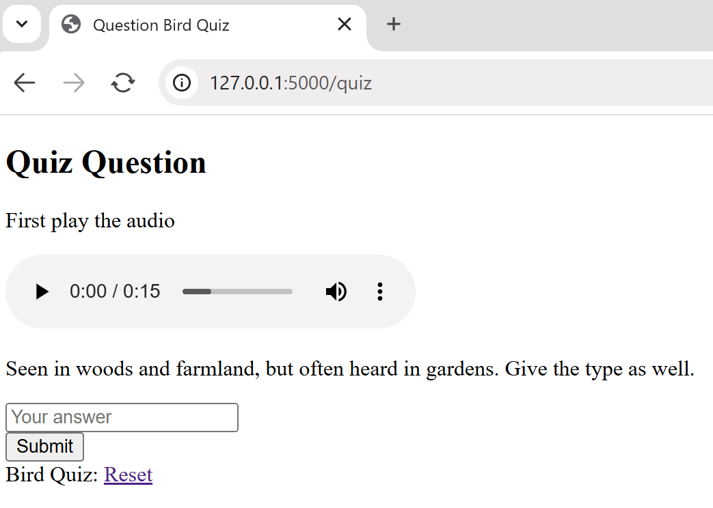

Adding a Database
=================

We will use sqlite3 as it is readily available and none of the data is particularly
valuable. The data can be loaded as one table, check on the two sets of dummy 
data, the table requires a unique column *id* two columns for *query* and *ans*
then a column for *song*.

Adding Song Files
-----------------

*song* will point to the file. As we are going to store
the songs in the static directory in the sub-folder *songs* check how jinja2
retrieves information from static files using *url_for*::

   sound = url_for('static', filename=soundfile)

Within *quiz.html* audio controls plays the source as src = {{sound}}, therefore
the *song* files will all require *songs/* immediately preceding the filename.

The bird songs came from `xeno-canto.org <https://xeno-canto.org/>`_, which 
are extraordinaly comprehensive.

By now your files should be as follows::

      
      Flask
         ├──static
         │   └──songs
         │      ├──Common Cuckoo.wav
         │      ├──Common Wood Pigeon.wav
         │      ├──Eurasian Blue Tit.mp3
         │      ├──Eurasian Skylark.mp3
         │      └──European Green Woodpecker.mp3
         │
         ├──templates
         │  ├──base.html
         │  ├──home.html
         │  ├──index.html
         │  ├──quiz.html
         │  └──result.html
         │
         ├──bird.py
         ├──config.py
         ├──venv
         └──quizbird.csv

Create a Database
-----------------

When creating a database the most difficult part is setting up a csv file that
can easily be loaded into the database. All spreadsheets have the ability to
create a csv file, so choose your spreadsheet and create the named columns.
When saving as an csv file ensure that it is saved in UTF-8 format with semi-
colons as separators, also create the first column with numbers starting from
1 and incrementing by 1 to 5 call it *id* ::

   id;question;song;answer
   1;Heard by woodland edge and near reed beds, a sure sign of Spring;songs/Common Cuckoo.wav;Cuckoo
   2;Seen in woods and farmland, but often heard in gardens. Give the type as well. ;songs/Common Wood Pigeon.wav;Wood Pigeon
   3;Found in woodlands, parks and gardens. Give the type as well. ;songs/Eurasian Blue Tit.mp3;Blue Tit
   4;Heard over grassland, marshes and heathland;songs/Eurasian Skylark.mp3;Skylark
   5;Heard and seen in woodlands, heaths and grassy areas. Give the type as well. ;songs/European Green Woodpecker.mp3;Green Woodpecker

Open a sqlite interface on the desktop at your *Flask* directory, in
Windows. Use cmd.exe, type in the following to create an sqlite3
database called mydb.db, the table columns are made automagically with the 
same name as the
first row of the table *birdquiz*::

   sqlite3 mydb.db

   sqlite> .mode csv
   sqlite> .separator ";"
   sqlite> .import quizbird.csv birdquiz
   sqlite> SELECT * FROM birdquiz;

Make sure that there are no empty lines at the end of the file - that
will show up when we ``SELECT * FROM birdquiz;``. 

.. sidebar:: Stopping Sqlite3

   Simply type in <ctrl c> (control key and c key together).

When retrieving 
data from the databank we will be doing it line by line, the first line
will be 1, no longer 0. *bird.py* needs changing from the dummy data to the
database::

   ....
   import sqlite3
   ...
   # Function to establish database connection
   db_connection = lambda: sqlite3.connect("mydb.db")

Remove the dummy data *quizlet*.

Within *index*
route change the starting value of *session["count"]* from 0 to 1::

   ...
   session.pop("count", None)
   session["count"] = 1
   ...

Change
the conditional clause *if session["count"] > 1:* to *if session["count"] > 5:* ::

   @app.route('/quiz', methods=['GET', 'POST'])
   def quiz():
   if session["count"] > 5:

Soon after is *user_answer* this is compared to the *correct_answer* from
the database::

   ....
   if request.method == 'POST':
      question_id = request.form.get('question_id')
      user_answer = request.form.get('user_answer').strip().title()
      # Fetch the correct answer from the database
      conn = db_connection()
      cursor = conn.cursor()
      cursor.execute("SELECT answer FROM birdquiz WHERE id = ?", (question_id,))
      correct_answer = cursor.fetchone()[0].strip().title()
      cursor.close()
      conn.close()

This replaces::

   correct_answer = quizlet[session["count"]]['ans'].strip().title()

A little later a single row is retrieved from the database, this replaces::

   select = quizlet[session["count"]]
   soundfile = select['song']

replaced by::

   conn = db_connection()
   cursor = conn.cursor()
   cursor.execute("SELECT id, question, song FROM birdquiz WHERE id = ?", (session["count"],))
   select = cursor.fetchone()
   conn.close()
   soundfile = select[2]

To play the songs we will need song files. Create a new folder *static*,
with a sub-folder *songs*. *static* is at the same level as the folder 
*templates*.

Change *quiz.html* from::

   
{{ select['query'] }}

   ....
   <input type="hidden" name="question_id" value="{{ select["id"] }}" >

to::

   
{{ select[1] }}

   ....
   <input type="hidden" name="question_id" value="{{ select[0] }}" >

As this is a demonstration there are only 5 questions remember to increase the
limit if you have more questions.

At present the application is functional, but has no feedback to the users of how
well they did.

Database File Updates
---------------------

Apart from bird.py and quiz.html no files were updated, but the bird songs and
quizbird.csv are new. mydb.db is simply formed by copying the instructions above.
