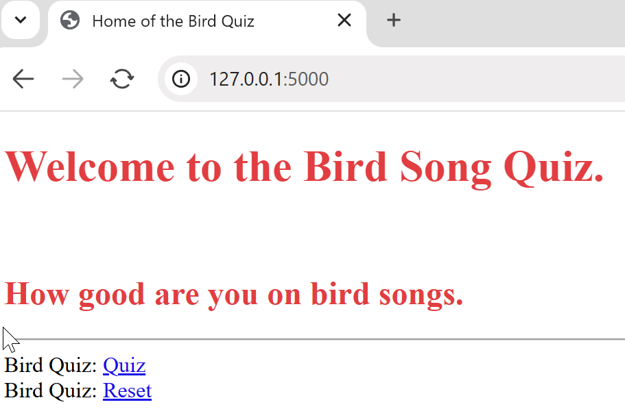
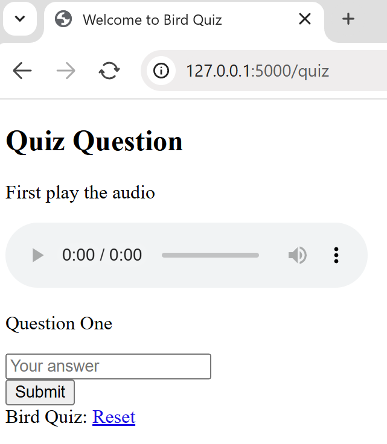
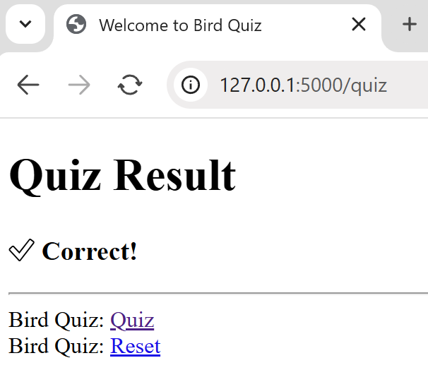
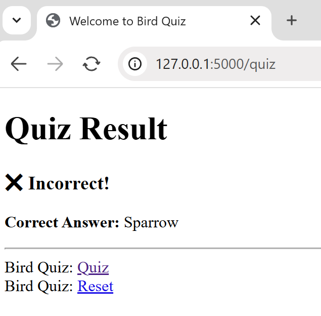

==============================
Add the Result and Final Pages
==============================
.. sidebar::   Special Characters

   There are two special characters in *result.html*, one shows a large tick
   the other a large cross, these should render on your web browser.

Now create the answer page (*result.html*). Build using *base.html*, tell the
user where they are, then according to whether they are right or wrong, display
the result - all this is simpler than the question page(*quiz.html*)::

   

   
      <h1 class="text-center">Quiz Result</h1>
      
         <h3 class="text-success">✅ Correct!</h3>
      
         <h3 class="text-danger">❌ Incorrect!</h3>
         
<strong>Correct Answer:</strong> {{ correct_answer }}

      
   

.. sidebar::   Links to *bird.py*

   All links given in the templates are from one html page to another, in 
   reality the links
   are re-directed to *bird.py* for control before going onward.

If used as it stands the application only has one link to the home page 
(*index.html*), so the user is trapped at the start. We could add extra links
to *base.html* for the other pages, but this would confuse the user as to 
which to use, better 
to guide the user by restricting their choice and change this at every page.

The links required are as follows

.. code-block::

   index  --> quiz
   quiz   --> result (this will come from submit button)
   result --> quiz
   quiz   --> final (when there are no more questions)
   final  --> index
   quiz, result and final --> index (reset button)

For the moment keep the index link on *base.html* but change its position
until after the *block content*, when the extra links are made within 
the *block content* they will precede the index link, *base.html* becomes::

   ....
      <body>
         
         
Bird Quiz: <a href="{{ url_for('index') }}">Reset</a>

      </body>
   </html>

*index.html* becomes::

   ....
      <h2>How good are you on bird songs.</h2>
      

      
Bird Quiz: <a href="{{ url_for('quiz') }}">Quiz</a>

     

*result.html* becomes::

   ....
      
      

      
Bird Quiz: <a href="{{ url_for('quiz') }}">Quiz</a>

   

*final.html* can be added, it is in essence a farewell message. Once again
use *base.html*::

   

   
   <h2 class="text-center">End of Quiz</h2>
   
<strong>Well done you've reached the finish, hopefully
        having learnt a bit along the way  
        - thankyou for taking part.
        Now please reset for the next participant.</strong> 

   

It will be reached when there are no more questions.

At present a few necessities are not yet in place, there still is only dummy
data in place, this will be replaced by an sqlite3 database. The questions
should be asked sequentially for every user. When all the questions are asked
finish off the quiz. The styling 
needs to be applied, this can be subjective but as it stands the quiz will
not win any prizes.

The first problem we should solve will be the sequential asking of the questions,
as it stands only the first question can be posed, so *final.html* cannot
yet be displayed.

The Results so far
------------------

By now your files should be as follows::

         Flask
         ├──templates
         │  ├──base.html
         │  ├──home.html
         │  ├──index.html
         │  ├──quiz.html
         │  └──result.html
         │
         ├──venv
         ├──bird.py
         └──config.py

   

   

+---------+--------+--------+----------+
| |home|  | |quiz| | |corr| | |incorr| |
+---------+--------+--------+----------+
| index   |  quiz  | right  |  wrong   |
+---------+--------+--------+----------+

Starting on our journey, we cannot yet show the *final.html*.