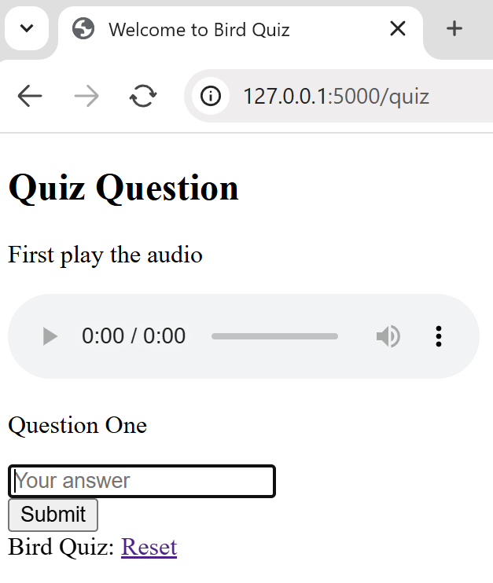
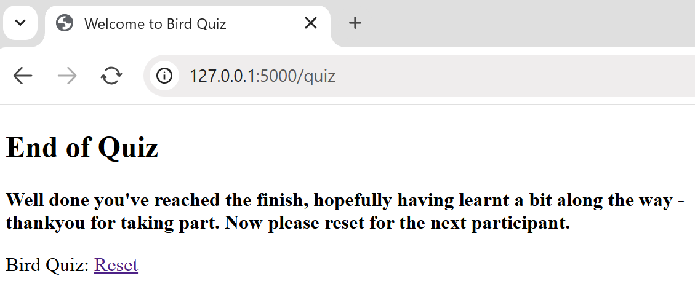

========
Sessions
========

If you have worked with any computor languages saving data in a variable has
been straightforward with few restrictions, in Flask only specific variables
can be used, since each user (session) may be looking at the same variable
but they could have different values. The variable is tied to a user by a 
cookie so that they respond correctly. For this reason when using *session*
there must be a secret key and *session* has to be imported from Flask.

We can reuse config.py for our secret key, still *bird.py* has to import session::

   from flask import Flask
   from flask import render_template, request, url_for, session
   from config import Config
   .....

We can refer to session data as a dictionary object, storing and 
retrieving data using standard methods::

   if 'username' in session:
      return f'Logged in as {session["username"]}'
   return "You are not logged in"
   ...
   # logout
   # remove the username from the session if it's there
   session.pop("username", None)

In order to sequentially change the questions first create a session variable
*session["count"]* starting at ``0`` whenever a user enters the home page
(*index.html*) after session["count"] has been cleared::

   ....
   @app.route('/')
   def index():
      session.pop("count", None)
      session["count"] = 1
   ....

When routing through *quiz.html* the user may have or havn't answered, only
increase the count when the user has answered. Before the form in *quiz.html* is 
invoked check on the *count* magnitude, if
larger than the number of questions then go to *final.html*::

   ....
   @app.route('/quiz', methods=['GET', 'POST'])
   def quiz():
   ....
      correct_answer = birdquiz[session['count']]['ans'].strip().title()
      score = 1 if user_answer == correct_answer else 0
      if session["count"] > 2:
         return render_template('final.html')
      session["count"] += 1
      return render_template('result.html', correct=score == 1, correct_answer=correct_answer)

When the route is on POST the user has answered, therefore the 
count can be increased. Place the session["count"] += 1 command just before
we render_template('result.html' ... ).

Whilst checking through the question, answer and final note the wording in
the browser tab, it says "Welcome to Bird Quiz", our default title. Easily
corrected::

   ....
   return render_template('result.html', correct=score == 1, correct_answer=correct_answer,
   title='Result')
   ....
   return render_template('quiz.html', select=select, sound=sound, title='Question')
   ....
   return render_template('final.html', title='End of')

You did check the working of everything, didn't you? What doesn't work as expected?
Yep it was the transfer to the final template. As it stands after the second
question's result is given there are no more questions so we never exceed ``2``. 
The query for the number of questions asked is in the wrong position.
We need to give the second question's result, return to *quiz.html* then before 
the form is built
check on the number of questions asked. As we are starting from *0*  
*session["count"]* should be greater than *1*.
Modify *bird.py* as follows::

   def quiz():
      if session["count"] > 1:
         return render_template('final.html', title='End of')
      if request.method == 'POST':
         user_answer = request.form.get('user_answer').strip().title()
         correct_answer = quizlet[session['count']]['ans'].strip().title()
         score = 1 if user_answer == correct_answer else 0
         session["count"] += 1
         return render_template('result.html', correct=score==1,
            correct_answer=correct_answer, title='Result ')
         .....

   

+--------+---------+
| |quiz| | |final| |
+--------+---------+
|  quiz  |  final  |
+--------+---------+

We need real data, let's first add a database. 
