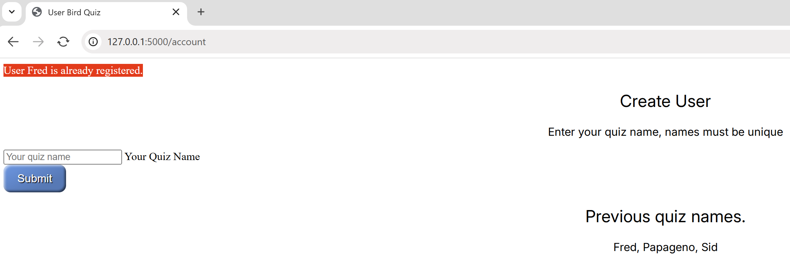

Styling
=======

At present the application is functional, but needs styling and making
the application more user friendly. The input
for both the quiz name and question have poor feedback, it is difficult to tell
whether the text input is ready to be used. Whenever a fault is made the user
requires better feedback on what is the problem.

As far as possible make the styling in
css files placed under the folder *static/css*. 

Flash Messaging
---------------

Flask has a feedback system called *flash*. These have optional categories
success, error, info and warning. A message is generated within the application
and is then displayed at the relevant template. An error or warning message
displays at the template where the problem arises, but a success or info message
will often occur at the next template, depending on the application logic. Since
all templates might display a message the mechanism to display can be
delegated to *base.html*.

Flash has to be imported into *bird.py* and requires a hidden key, this is
already covered by our *config.py*.

To make the messages standout apply a style. This can be part of a general style
file. If we treated all messages alike as errors, say, then our template needs a
Jinja method to display::

    <h1>Flashing messages</h1>
    
      
Error: {{ message }}

    

and we only need one method in our styling file, place this in *base.html* just
before the call for ::

   .alert-error {
      background-color: red;
      color: white;
   }

Since we wish to have different categories we need to change our methods in 
*base.html*::

   
      
Message: {{ message }}

   

and our styling becomes::

   .alert {
      display: inline-block;
      padding: 12px;
      border-radius: 3px;
      font-size: 1.2rem;
      margin-bottom: 16px;
      border-width: 2px;
      border-style: solid;
   }

   .alert-error {
      display: inline-block;
      border-color: darkred;
      background-color: red;
      color: white;
   }

   .alert-warning {
      display: inline-block;
      border-color: orange;
      background-color: yellow;
      color: black;
    }

   .alert-info {
      display: inline-block;
      border-color: blue;
      background-color: cyan;
      color: black;
    }

Create a style sheet applicable to all templates, place it in the *static* folder
in its own sub-folder *css*. The first entry of *all.css* will style the 
flash messages.

By now your files should be as follows::

      
      Flask
         ├──static
         │   ├──css
         │   │  └──all.css
         │   │
         │   └──songs
         │      ├──Common Cuckoo.wav
         │      ├──Common Wood Pigeon.wav
         │      ├──Eurasian Blue Tit.mp3
         │      ├──Eurasian Skylark.mp3
         │      └──European Green Woodpecker.mp3
         │
         ├──templates
         │  ├──index.html
         │  ├──base.html
         │  ├──quiz.html
         │  ├──result.html
         │  ├──final.html
         │  └──account.html
         │
         ├──bird.py
         ├──venv
         ├──config.py
         └──quizbird.csv

Another change to *base.html* is to add a link to our newly made style file *all.css*,
put it in the <head> section, use the Jinja format to point to the stylesheet::

   <link rel="stylesheet" type="text/css" href="{{url_for('static', filename='css/all.css')}}" />

Modern Font
-----------

Let's ensure that all the fonts are of a modern unified look, load up the google
*Inter* font. Put the following lines into *base.html* just before the link to the
stylesheet link::

   <link rel="preconnect" href="https://fonts.googleapis.com"> 
	<link rel="preconnect" href="https://fonts.gstatic.com" crossorigin>
	<link href="https://fonts.googleapis.com/css2?family=Inter:ital,opsz,wght@0,14..32,100..900;1,14..32,100..900&display=swap" rel="stylesheet">

Now we can use the font in our stylesheet, *all.css*::

   /*
   // <weight>: Use a value from 100 to 900
   // <uniquifier>: Use a unique and descriptive class name
   // when in css file keep all the types (h1..h3) separate, 
   // can join when used in html page
   // keep the types in size order
   */
   
   h1 {
      font-family: "Inter", sans-serif;
     font-optical-sizing: auto;
     font-weight: 500;
     font-style: normal;
     text-align: center;
     font-size: 40px;
     }

   h2 {
     font-family: "Inter", sans-serif;
     font-optical-sizing: auto;
     font-weight: 400;
     font-style: normal;
     text-align: center;
   }

   h3 {
      font-family: "Inter", sans-serif;
      font-optical-sizing: auto;
      font-weight: 500;
      font-style: normal;
      text-align: center;
      font-size: 20px;
   }

   p {
      font-family: "Inter", sans-serif;
      font-optical-sizing: auto;
      font-weight: 400;
      font-style: normal;
      text-align: center;
   }

So that *index.html* is a bit more eyecatching put a shadow behind the lettering,
use class "shadow", remove the inline styling :

   <h1 class="shadow">Welcome to the Bird Song Quiz.</h1>
    
   <h3 class="shadow">How good are you on bird songs.</h3>

Now add the *h1.shadow* and *h3.shadow* to *all.css*::

   h1.shadow {
  font-family: "Inter", sans-serif;
  font-optical-sizing: auto;
  font-weight: 500;
  font-style: normal;
  text-align: center;
  font-size: 40px; 
   text-shadow: 3px 3px 3px #ccff02;
   color: #ff073a;
   }
   
  h3.shadow {
  font-family: "Inter", sans-serif;
  font-optical-sizing: auto;
  font-weight: 500;
  font-style: normal;
  text-align: center;
  font-size: 20px;
   color: #ff073a;
   text-shadow: 2px 2px 2px #ccff02;
   }

If we were to run the application the *Flash* messaging would be in a default
font style, adapt the stylesheet as follows::

   .alert {
      display: inline-block;
      padding: 12px;
      border-radius: 3px;
      font-family: "Inter", sans-serif;
      font-optical-sizing: auto;
      font-weight: 900;
      font-style: normal;
      font-size: 1.2rem;
      margin-bottom: 16px;
      border-width: 2px;
      border-style: solid;
   }

Buttons instead of Links
------------------------

A good looking button is better than an html link. The  button's pattern is
borrowed from mdn Mozilla. Use a blue button for sequential links and a grey button
for the reset/return to the home page, add to *all.css*::

   .button {
      border: 0;
      height: 75 px;
      line-height: 2.5;
      padding: 0 20px;
      font-size: 1rem;
      text-align: center;
      color: #fff;
      cursor: pointer;
      text-shadow: 1px 1px 1px #000;
      border-radius: 10px;
      background-color: rgba(87, 153, 230, 1); /* blue */
      background-image: linear-gradient(
         to top left,
         rgba(0, 0, 0, 0.2),
         rgba(0, 0, 0, 0.2) 30%,
         rgba(0, 0, 0, 0)
      );
      box-shadow:
         inset 2px 2px 3px rgba(255, 255, 255, 0.6),
         inset -2px -2px 3px rgba(0, 0, 0, 0.6);
   }

   .blue {
	  background-color: rgba(87, 153, 230, 1);
	  color: white;
	  height: 75 px;
   }

   .blue:hover {
      background-color: rgba(71, 97, 229, 1); 
   }

   .blue:active {
      box-shadow:
         inset -2px -2px 3px rgba(255, 255, 255, 0.6),
         inset 2px 2px 3px rgba(0, 0, 0, 0.6);
      }

   .grey {
	  background-color: rgba(110, 117, 125, 1);
	  color: white;
      }

   .grey:hover {
      background-color: rgba(44, 65, 102, 1); 
      }

   .grey:active {
      box-shadow:
         inset -2px -2px 3px rgba(255, 255, 255, 0.6),
         inset 2px 2px 3px rgba(0, 0, 0, 0.6);
      }

   

+---------+---------+-----------+
| |home|  |  |acc|  |  |dupl|   |
+---------+---------+-----------+
| index   | account | duplicate |
+---------+---------+-----------+

+--------+--------+----------+---------+
| |quiz| | |corr| | |incorr| | |final| |
+--------+--------+----------+---------+
|  quiz  | right  |  wrong   |  final  |
+--------+--------+----------+---------+

Much of the styling is in place, but we can see odd bits are not centralised
nor is the input in the forms user friendly. The buttons could be better positioned
to each other and against the text of each template. Let's see what we can do.