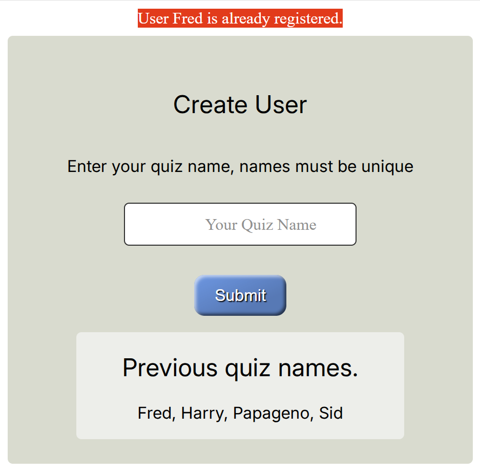

Styling Form
============

Form requires special styling, we wish to give the user feedback as 
whether they are in the input field or not. The field shows what should be
filled in, then when the cursor sits in the field the information moves out
of the way, so the user still has the original hint on display.

Create a new styling file *form.css* place it in the *static/css* folder::

   html .form__input {
      width: clamp(120px, 20vw, 420px); /* min, preferred val max */
      height: 2.5rem;
      padding: 0 1.25rem;
      border: 1px solid #303030;
      border-radius: 5px; /* 2px */
      margin: 0.625rem auto;
      transition: all 250ms;
   }

   html .form__input:focus {
      outline: none;
      border-top-color: rgba(0, 0, 0, 0.1);
   }
   
   html .form__input:focus + .form__label, html .form__input:not(:placeholder-shown) + .form__label {
      transform: translateY(-4.5rem) scale(1);
      color: #303030;
   }

   html .form__input::placeholder {
      display: none;
      color: transparent;
      -webkit-user-select: none;
      /* Safari */
      -ms-user-select: none;
      /* IE 10 and IE 11 */
      user-select: none;
      /* Standard syntax */
   }

   html .form__input:not(:placeholder-shown) {
      border-top-color: rgba(0, 0, 0, 0.5);
   }
   
   html .form__label {
      font-size: 1rem;
      color: #909090;
      display: block;
      /* Moves the label on TOP of the placeholder */
      /* You'll need to change this as needed */
      transform: translate(1.25rem, -2.5rem);
      transform-origin: 0 0;
      /* Used later for transitions */
      transition: all 500ms;
      -webkit-user-select: none;
      /* Safari */
      -ms-user-select: none;
      /* IE 10 and IE 11 */
      user-select: none;
      /* Standard syntax */
      /* THIS PART IS IMPORTANT! */
      /* This line prevents the label from being selected.*/
      /* This is crucial because if this line doesn't exist, users can
         click on the label, instead of the input field. That's bad UX! */
      pointer-events: none;
   }

Both *account.html* and *quiz.html* need to link to *form.css* insert in the
top part of the <body>::

   <link href="{{url_for('static', filename='css/form.css')}}" rel="stylesheet" />

Just after the <input type="text"... put the following <label> for *account.html*::

   <label for="name" class="form__label">Your Quiz Name</label>

and for *quiz.html*::

   <label for="name" class="form__label">Your Answer</label>

As the inputs are on the left hand border, and the writing is placed centrally
it is time to tackle the styling. Put all the html information, output and
forms into a coloured *container*, with sub-components in a separate less wide
*card container* in a different colour. Add the following to *all.css*::

   html body .container {
      width: 100%;
      max-width: 390px; /* 450 768 */
      display: flex;
      flex-direction: column;
      justify-content: center;
      align-items: center;
      padding: 2rem 2rem 1.5rem;
      background-color: #d8dbce;
      border-radius: 5px;
      margin: 0 auto; 
      margin-top: 0.5rem;    
   }

   html body .container .card {
      width: 100%;	
      max-width: 20rem; /* 365px */
      margin-top: 1rem;
      text-align: center;
      background-color: #edeee9;
      border-radius: 5px;
   }    

While we are at it add three positional styles::

   .static {
      position: static;
      padding-top: 20px;
      text-align: center;
   }

   .center {
      text-align: center;
   }

   .bottom {
      text-align: center;
      position: fixed;
      bottom: 5px;
      left: 0%;
      right: 0%;
   }

Starting with *index.html* ensure that the styling changes will be enacted.
Make certain that the *blue button* is inside a div tag with the class 
attribute *center*::

      

         <a href="{{ url_for('account') }}">
            <button class="button blue">Start Quiz</button>
         </a>
      

Remove 
 it seems superfluous.

Now for *account.html*, place all the heading and form within a *container*,
to set off the previous quiz names inside *card*, the *container* comes just
after the <body> tag and link to the *form.css*::

   ...
   <body>
      <link href="{{url_for('static', filename='css/form.css')}}" rel="stylesheet" />
      

         <h2>Create User</h2>
      ...

Place the *card* div just before the heading for previous quiz names::

   ...
   

      <h2> Previous quiz names. </h2>
   ...

Just before the body finishing tag place the two div finishing tags::

   ...
   
 {{ accounts }} 

         

      

   </body>
     

*quiz.html* has a *container* over the heading and form, place it just below
the link to *form.css*::

   ...
   <body>
  <link href="{{url_for('static', filename='css/form.css')}}" rel="stylesheet" /> 
   

      <h2>Quiz Question</h2>
   ...

Place a *card* just before the audio method::

   ....
   

      
First play the audio

   ...

Finish off the *card* div at the *audio* block::

      </audio>
   

      

   ...

Finish off the *container* div just after the div for *bird-form* finishes::

   ...
      

   

   ...

Finally position the *grey button* at the page bottom::

   

      <a href="{{ url_for('index') }}">
       <button class="button grey">Reset</button>
      </a>
   

Onto *result.html*. Make a *container* to cover the heading and result, place
the div just after the <body> tag::

   ...
   <body>
   

   <h2>Quiz Result</h2>
   ....

Add a *card* immediately after the heading::

   ...
   <h2>Quiz Result</h2>
   

      
   ...

Finish off the *card* div just after  and remove 
::

   ...
      
   

   ...

Put the finishing off tag for *container* at the end of the *blue button*
link::

   ...
      <button class="button blue">Next Question</button>
     </a>
     

Ensure that the *grey button* is placed at the page bottom::

   

   <a href="{{ url_for('index') }}">
       <button class="button grey">Reset</button>
   </a>
   

Finally onto *final.html*, put *container* just after <body>::

   ...
   <body>
      

      <h2>End of Quiz</h2>
   ...

Place the score inside a *card*::

   

         
<strong>User {{user_score[0]}} had a total of {{user_score[2]}} from {{user_score[1]}} 
         The best was {{best_score[0]}} had {{best_score[2]}} 
   

Finish off *container* just before </body>::

      

   

   </body>
   

      

   

      

      

   

    

+--------+---------+--------+--------+--------+
| |home| | |start| | |dupl| | |user| | |quiz| |
+--------+---------+--------+--------+--------+
|  home  |  start  |  dupl  |  user  |  quiz  |
+--------+---------+--------+--------+--------+

+--------+---------+--------+-------+--------+
| |corr| | |wrong| | |best| | |tie| | |poor| |
+--------+---------+--------+-------+--------+
|  right |  wrong  |  best  |  tie  |  poor  |
+--------+---------+--------+-------+--------+

Run through the application and see that the styling changes have taken effect.
See how the submit button can be positioned either in the centre or the left
hand side, change to the position that looks the best to you. The end effect
is rather smart. If we had used a third party styling system like *Bootstrap*
there would still need to be most of the styling tags throughout the templates,
without the satisfaction of styling it ourselves.

