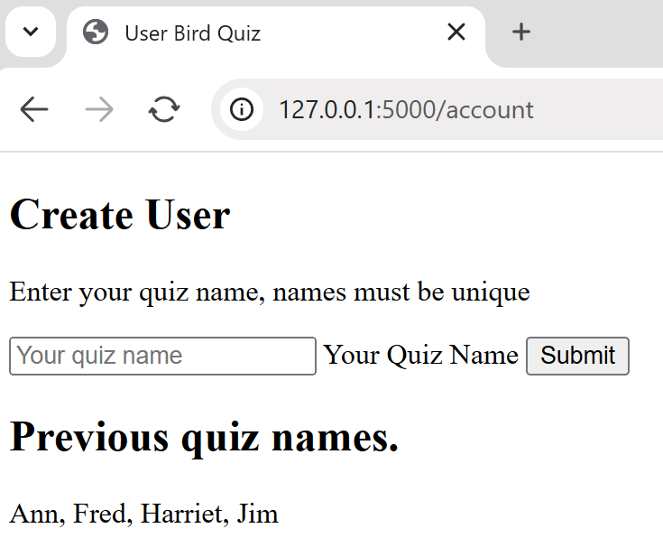
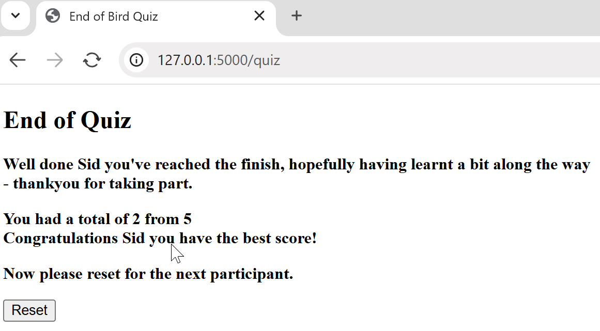
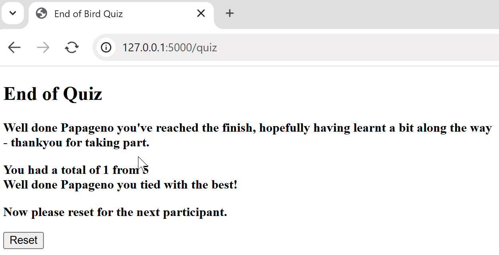
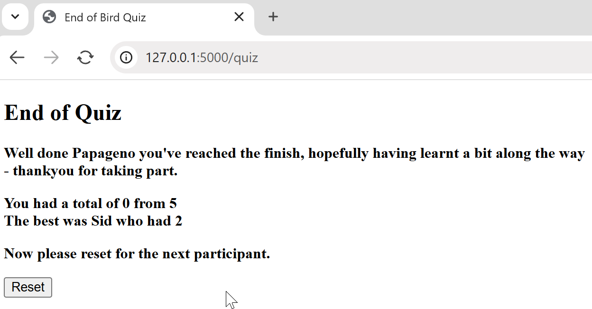

Feedback to Users
=================

Only a simple feedback to users is created here. After starting on the
home page *index.html*
the user will land on a new file *account.html*. The user is told to enter a quiz
name which must be unique, a form to make their quiz name then is followed by the
list of previous quiz names already used. If the user makes a mistake or uses a
previous name then they remain on the page, when successful they proceed to the
quiz page *quiz.html*. 

As the user answers questions their total of correct answers is kept, then at the
final page *final.html* their score is revealed and shown against the score of
the user with the most points.

The existing database *mydb.db* is utilized for a second table *users*, used to store
quiz names and their scores. 

Make Users Table
----------------

In the venv environment logon to the mydb.db database using cmd.exe::

   sqlite3 mydb.db
   sqlite3> CREATE TABLE IF NOT EXISTS users (
   >  id INTEGER PRIMARY KEY AUTOINCREMENT,
   >  username TEXT NOT NULL UNIQUE,
   >  correct INTEGER,
   >  tried INTEGER);

Note that the username is *unique* and *not null*, we shall be using this to 
check the validity of the quiz name.

Later if the number of users needs reducing, use cmd.exe::

   sqlite3 mydb.db
   sqlite3> DELETE FROM users;

Empties the table users, but keeps the table structure.

Database Integrity Error
--------------------------

When the table *users* was created *username* it most be unique and not null.
If am enduser gets it wrong the database does what it should do and gives an 
error message and tries to prevent further processing which would stop the 
application from running without a manual reset. Fortunately Python has the
*try* method, where the application can recover if we can forsee the error
and make provisions for it.

Normally the user enters their quiz user name and continues onto the quiz
template, otherwise they stay on the account template and need to resubmit
the user name. As we already have guessed they actually went to *bird.py* in
between.

Try it out yourself, check what happens if you enter a valid user name and a
duplicate. You knew that the application would expect you to try with another
name. What would a first time user require? That's right a bit of guidance as
to what to do next - see the next exciting chapter!

Alter Existing Files
---------------------

Start with changing *bird.py*, immediately after the home page at index there is
the new route for *account*, our page to create users::

   ...
   @app.route('/account', methods=['GET', 'POST'])
   def account():
   if request.method == 'POST':
      conn = db_connection()
      cursor = conn.cursor()
      user_name = request.form.get('user_name').strip().title()
      try:
         conn = db_connection()
         cursor = conn.cursor()
         sqlite_insert_with_param = "INSERT INTO users (username) VALUES (?);"
         data_tuple = (user_name,)
         cursor.execute(sqlite_insert_with_param, data_tuple)
         conn.commit()
      except sqlite3.IntegrityError:
         print("IntegrityError during inserting data:")
         conn.rollback()  # Rollback in case of error
         error = f"User {user_name} is already registered."
         conn = db_connection()
         cursor = conn.cursor()
         accounts = conn.execute('SELECT username FROM users ORDER BY username COLLATE NOCASE ASC').fetchall()
         accounts = ', '.join([item for tupl in accounts for item in tupl])
         cursor.close()
         conn.close()
      else:
         # redirect for post
         session["username"] = user_name
         return redirect(url_for("quiz"))
      return render_template('account.html', title='User', accounts=accounts)

   conn = db_connection()
   cursor = conn.cursor()
   accounts = conn.execute('SELECT username FROM users ORDER BY username COLLATE NOCASE ASC').fetchall()
   accounts = ', '.join([item for tupl in accounts for item in tupl])
   cursor.close()
   conn.close()
   return render_template('account.html', title='User', accounts=accounts)

Change the *quiz* route in *bird.py*, first at the section for *final.html*,
to include user and score information::

   def quiz():
   ....
   if session["count"] > 5:
      conn = db_connection()
      cursor = conn.cursor()
      cursor.execute("SELECT username, tried, correct FROM users WHERE username = ?", (session["username"],))
      user_score = cursor.fetchone()
      cursor.execute("SELECT username, tried, correct FROM users WHERE correct = (SELECT MAX(correct) FROM users)")
      best_score = cursor.fetchone()
      cursor.close()
      conn.close()
      return render_template('final.html', title='End of', user_score=user_score, best_score=best_score)

Next change *quiz* just after where it is determined whether the answer is
correct and the score is updated, we are using a custom function *add*, required
to increase the score when adding a null::

   ....
   if request.method == 'POST':
   ....
      score = 1 if user_answer == correct_answer else 0
      conn = db_connection()
      cursor = conn.cursor()
      cursor.execute("SELECT tried, correct FROM users WHERE username = ?", (session["username"],))
      status = cursor.fetchone()
      try:
         conn = db_connection()
         cursor = conn.cursor()
         cursor.execute("SELECT tried, correct FROM users WHERE username = ?", (session["username"],))
         status = cursor.fetchone()
         update_query = """Update users set tried = ?, correct = ? where username = ?"""
         columnValues = (add(status[0],1), add(status[1],score), session["username"])
         cursor.execute(update_query, columnValues)
         conn.commit()
         cursor.close()

      except sqlite3.Error as error:
         print("Failed to update multiple columns of sqlite table", error)

      finally:
         if conn:
            conn.close()
      session["count"] += 1
      return render_template('result.html', correct=score==1,
                correct_answer=correct_answer, title='Result')

We require a new function *redirect* used when a user 
is added::

   from flask import render_template, request, url_for, session, redirect

When updating the column values in the table users, we are using a custom 
function *add*,
this should be placed at the start of *bird.py* after the imports::

   def add(a, b):
      return (a or 0) + (b or 0)

Since we are changing the links with the addition of *account.html*, note the
revised links are as follows::

   index  --> account
   account --> quiz  (this will come from the submit button)
   quiz   --> result (this will come from the submit button)
   result --> quiz
   quiz   --> final (when there are no more questions)
   final  --> index
   quiz, result and final --> index (reset button)

*base.html* loses the link to index.

*index.html* changes the link from {{ url_for('quiz') }} to {{ url_for('account') }}.

Add the following to *quiz.html*, *result.html* and *final.html* just before
::

   

	<a href="{{ url_for('index') }}">
       <button class="button grey">Reset</button>
	</a>
	
	

We need a new file *account.html* placed in the *templates* folder, as before
use *base.html* to reduce its size::

   

   
      <body>
      <h2>Create User</h2>
         
Enter your quiz name, names must be unique

   

     <form method="POST" class="form">
          <input type="text" name="user_name" class="form__input" placeholder="Your quiz name" required oninvalid="this.setCustomValidity('Put your quiz name here')" oninput="this.setCustomValidity('')" title="Put your quiz name here" autocomplete="off" required>
          <label for="name" class="form__label">Your Quiz Name</label>
          

               <button type="submit" class="button blue">Submit</button>
          

	  </form>
   

   	<h2> Previous quiz names. </h2>
	  
 {{ accounts }} 

   

Lastly *final.html* needs updating to show the results of the quiz, add the
following to the part where we thank them for taking part::

      Well done {{user_score[0]}} you've reached the finish, hopefully
   	having learnt a bit along the way - thankyou for taking part. 
		

         
<strong>You had a total of {{user_score[2]}} from {{user_score[1]}} 
         The best was {{best_score[0]}} who had {{best_score[2]}} 
		 

		
<strong>Now please reset for the next participant.</strong> 

What if the Best Score Changes
------------------------------

The present system uses::

   best_score = cursor.fetchone()

This returns the first user who has the highest score, in reality the present
user could equal or have the best score, at the least our reaction at 
*final.html* should be different. The most difficult situation is when the
user equals the best score, if we needed to select more than one user
we would use::

   cursor.execute("SELECT username, tried, correct FROM users WHERE correct = (SELECT MAX(correct) FROM users)")
   best_score = cursor.fetchall()

This changes our variable *best_score* from something like::

   best_score = ('Fred', '5', '5')

to::

   best_score = [('Fred', '5', '5'), ('Harry', '5', '5')]

Which changes from a tuple to a list of tuples. If there is only one best then it
becomes::

   best_score = [('Fred', '5', '5')]

When using *fetchone* best_score[0] returned 'Fred', but if we use *fetchall*
best_score[0] returns the tuple ('Fred', '5', '5'). Now if we want just 'Fred'
we must use best_score[0][0] whether Fred is a singleton or one of many.

.. sidebar::  Jinja Conditional Statements

   The syntax closely follows Python conditional statements, but also requires
   a closing statement::
   
      
         statement_1
      
         statement_2
      ....
      
         statement_n
      
   
   (There is a scroll bar ^here^)
   When using two or more if statements each require its own endif clause.
   Variables within an if or elif clause do not require curly brackets.
   Note the full colon at the end of the conditional clause, but is not 
   required for simple *if* clauses or *else* clauses.

Checking on the conditional requirements within *final.html* we no longer 
need more than one user for the best, since we are only need the first best
user in the event of a tie. Keep the cursor selections unchanged in *bird.py*.

We should have enough information to decide how to treat our user at *final.html*,
the only difficulty is that our conditional statements have to be in Jinja2.

We can find out whether the current user has become the best, in which case
they become best_score[0] (only a tuple), if the current user
ties with the best user then they the same score but are not best_score[0].

Expand the two lines in *final.html*::

   
You had a total of {{user_score[2]}} from {{user_score[1]}} 
   The best was {{best_score[0]}} who had {{best_score[2]}}</p 

to become::

   
You had a total of {{user_score[2]}} from {{user_score[1]}} 
   
      
         Congratulations {{user_score[0]}} you have the best score! 
      
         Well done {{user_score[0]}} you have tied with the best! 
      
   
      The best was {{best_score[0]}} who had {{best_score[2]}}</p 
   
 
User File Update
----------------

   

      

+--------+--------+-------+--------+
| |user| | |best| | |tie| | |poor| |
+--------+--------+-------+--------+
|  user  |  best  |  tie  |  poor  |
+--------+--------+-------+--------+

All the existing html files were updated and account.html was created. *bird.py*
was altered.
